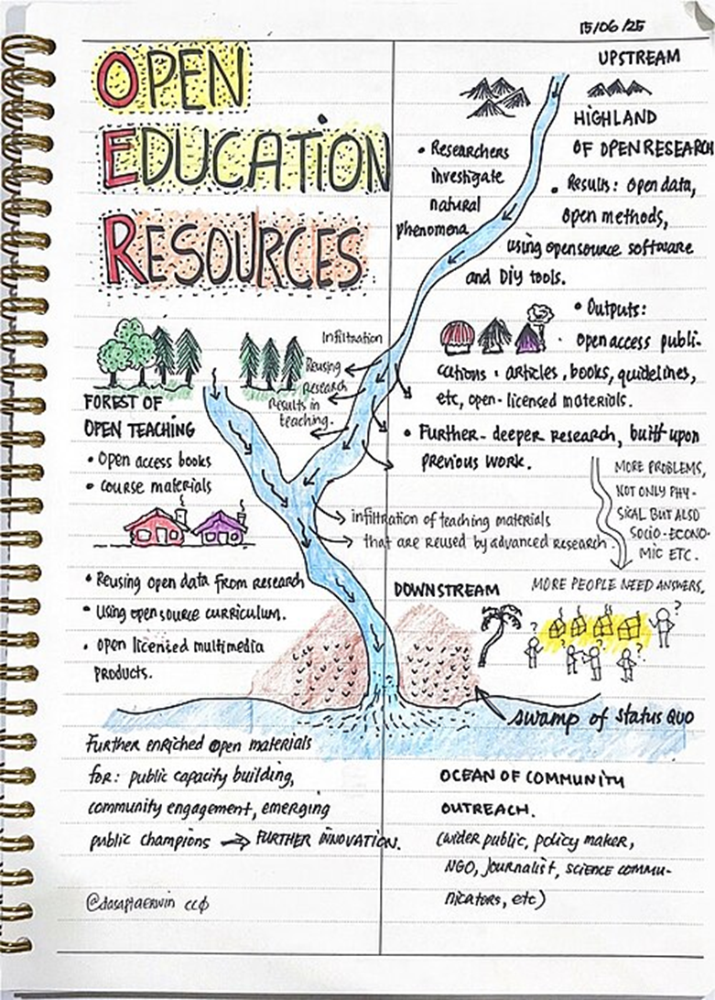

The development of OERs spans several decades as described by the Oklahoma Council for Online Learning Excellence (COLE) [@RN68098].

::: callout-note
## OER Timeline

**1994** — Term *learning object* is introduced by Wayne Hodgins, marking early interest in reusable digital content.\
**1997** —  becomes one of the first OER repositories.\
**1998–2001** — *Open content* emerges as a concept, followed by the founding of Creative Commons.\
**2001** — MIT launches the OpenCourseWare project, demonstrating large-scale open material distribution.\
**2001** — , an interoperability protocol which facilitates harvesting metadata from distributed repositories is established.\
**2002** — UNESCO coins the term *Open Educational Resource*.\
**2007-2009** — Jisc's EdSpace Project results in EdShare being developed from Eprints software.\
**2010s onward** — Growth of MOOCs, repository networks, and interoperability standards.
:::

These developments collectively strengthened the ecosystem of discoverable, remixable educational materials, as depicted in the image below.

[{fig-alt="A cartoon showing the flow of knowledge from open research and teaching into the community in the form of a river system in a human geography setting"}](https://commons.wikimedia.org/wiki/File:ON_OPEN_EDUCATION_RESOURCES_SKETCHNOTE.jpg)

In the UK, the White Rose Libraries research project in 2021 [@RN64774] led to some participating institutions investing more resource into creating original content, demonstrating that culture and infrastructure are key to promoting engagement. For example, the University of Sheffield has a substantial catalogue of OERs at the time of writing. They have a working group who have created a website with case studies and examples of OERs created at the university https://sites.google.com/sheffield.ac.uk/oer-working-group/home [@RN65100]. Following a pilot in 2024, Coventry University took a robust position, committing to replacing reading list textbooks with open educational texts for their undergraduate programmes. They have worked with  to achieve their objectives.

[{fig-alt="Go to next page: Intro-myths.html" fig-align="center" width="50"}](Intro-myths.html)

-------------------------------
::: nav-footer
```{=html}
<a href="" aria-label="Go to previous page: ">
  <span aria-hidden="true">«</span> 
</a>

<a href="" aria-label="Go to next page: ">
   <span aria-hidden="true">»</span>
</a>
```
:::
