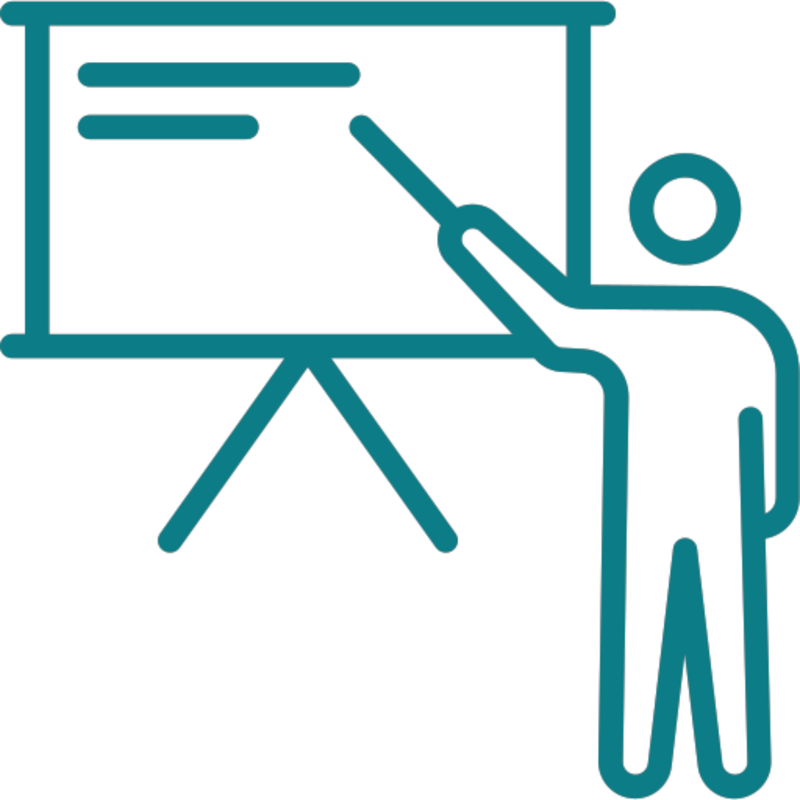

|  |  |  |  |
|------------------|------------------|------------------|------------------|
|  |  |  |  |
| Introduction to OERs | OERs for Users | OERs for Creators | Advanced: Modular OERs Using R and Quarto |

### Audience

This programme is designed for:

-   Educators, instructional designers, and learning technologists

-   Library and research support staff

-   Students and lifelong learners

-   Anyone wishing to create, adapt, reuse, or understand Open Educational Resources (OERs)

### Programme-wide Learning Outcomes

By the end of all four units, learners will be able to:

-   Define OERs and their attributes using internationally recognised definitions (UNESCO, Creative Commons).

-   Navigate, evaluate, and reuse OERs appropriately.

-   Create OERs that apply the , , and good licensing practice.

-   Produce reusable and computationally reproducible OERs using </abbr>,  with , including structuring source files, managing local terminology, and enabling remixing.

-   Share OERs in accessible, editable, future proof formats with transparent licensing and version control.
